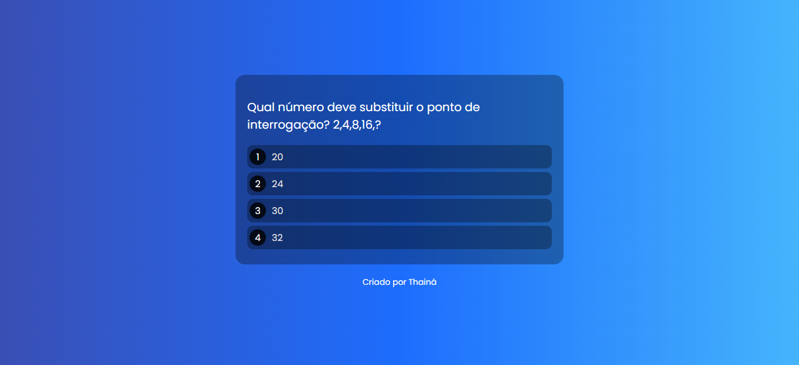

# PROJETO MIND QUIZ

**Mind Quiz** é um quiz de raciocínio lógico responsivo, desenvolvido para testar e melhorar suas habilidades de lógica. Ele permite que você veja quantos por cento das perguntas você acertou e oferece as soluções detalhadas de todas as questões após a finalização do quiz.

## Tecnologias Utilizadas

- **HTML**
- **CSS**
- **JavaScript**

## Funcionalidades

- **Quiz de Raciocínio Lógico:** Desafie-se com questões que testam suas habilidades de lógica.
- **Feedback Imediato:** Descubra sua pontuação ao final do quiz.
- **Soluções Detalhadas:** Veja as respostas corretas e explicações de todas as questões.
- **Responsividade:** Funciona perfeitamente em diferentes tamanhos de tela, de desktops a dispositivos móveis.

## Como Executar o Projeto

1. Clone o repositório:
    ```bash
    git clone https://github.com/seu-usuario/mind-quiz.git
    ```
2. Navegue até a pasta do projeto:
    ```bash
    cd mind-quiz
    ```
3. Abra o arquivo `index.html` no seu navegador preferido.

## Imagens do Projeto

<!-- Adicione imagens do seu projeto aqui -->




## Contribuição

Sinta-se à vontade para contribuir com este projeto. Abra uma issue ou envie um pull request com melhorias, correções ou novas ideias!

## Licença

[](https://opensource.org/licenses/MIT)

---

Desenvolvido por **Thainá dos Santos Silva**


